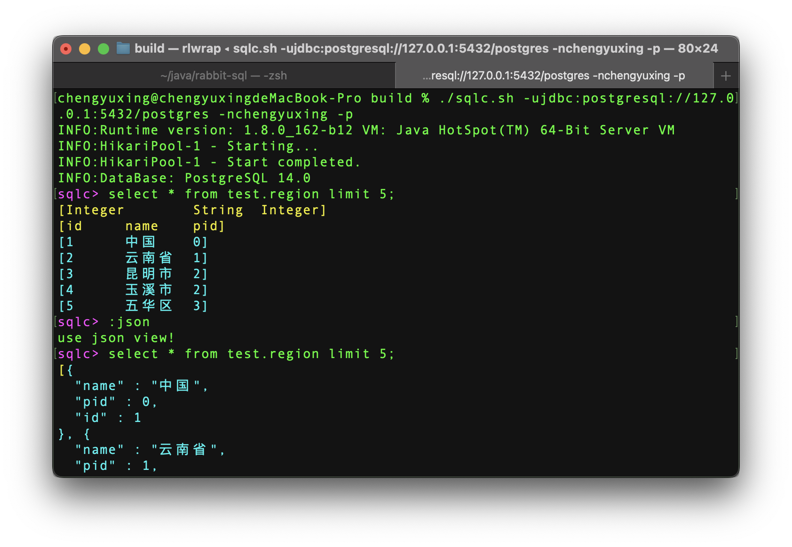
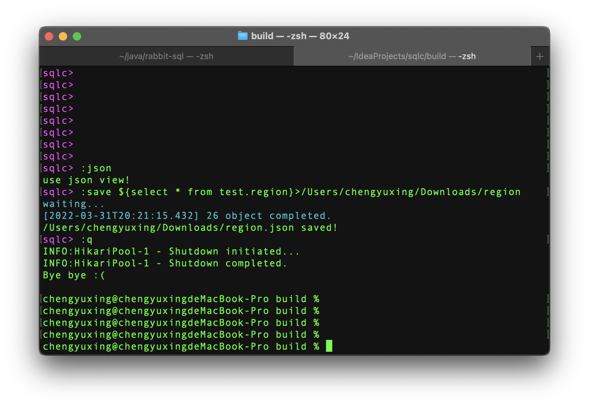
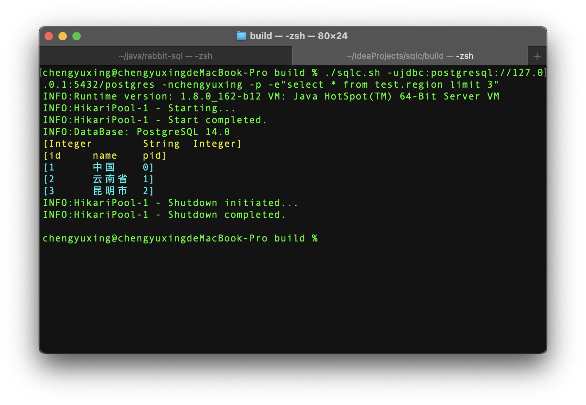
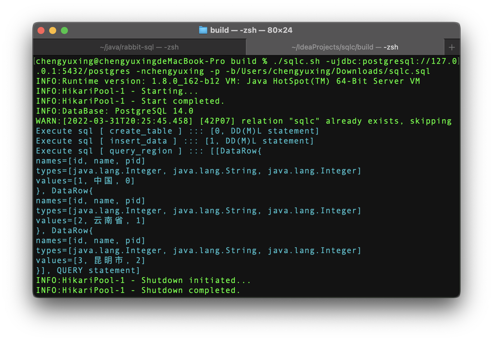

# 关于SQLC
支持完善：Linux | MacOS  
基本可用：Windows
- 一个简单的sql命令行工具，支持增、删、改、查；
- 支持`mysql, oracle, postgreSQL, sqlServer，sqlite`数据库，可自行添加jdbc驱动文件到**drivers**目录下；
- 支持导出文件类型：`xlsx，json，tsv，csv`；
- 支持数据库关键字提示，根据指定数据库加载**completion**文件下的配置文件**（依赖C库：`readline`，`rlwrap`）**；
- 支持路径自动完成提示**（依赖C库：`readline`，`rlwrap`）**；
- 支持命令行历史记录**（依赖C库：`readline`，`rlwrap`）**；
- 支持命令模式和交互模式；

## 帮助文档

`sqlc.sh -h` 或 `sqlc.sh --help`

## 截图
交互模式基本查询，切换数据展示视图

交互模式将查询结果导出到文件中

命令模式执行输出一条sql查询

命令模式批量执行sql文件中的一些sql

